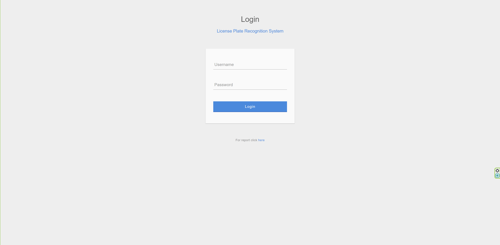
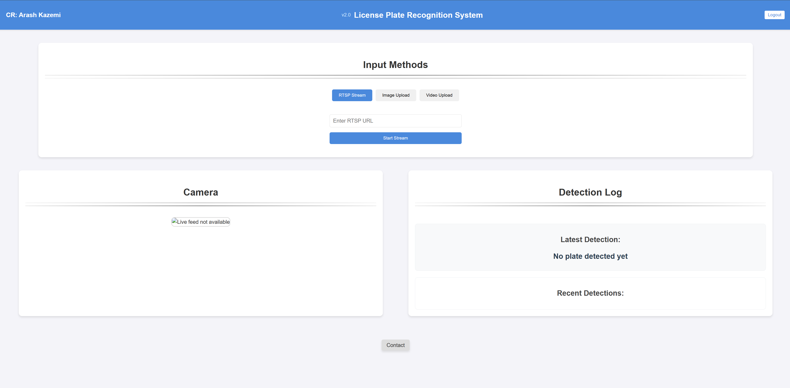

# License Plate Recognition and Persian OCR Application

## Overview

This repository showcases a robust **License Plate Recognition** and **OCR (Optical Character Recognition)** system tailored for Persian license plates. The project combines advanced deep learning techniques and a user-friendly web interface to detect and recognize license plates captured from security checkpoints or scale cameras.

---

## Features

- **License Plate Detection:**
  - Utilizes a custom-trained YOLOv5 model for accurate plate detection.
  - Tested on a diverse dataset for robust performance.
  - Real-time detection capabilities.
  - Supports multiple input sources (RTSP, video files, images).

- **Persian License Plate OCR:**
  - Custom-trained OCR model specifically for Persian characters and numbers.
  - Handles Persian character mapping to ensure correct outputs.
  - Supports both standard and special format Persian plates.
  - Real-time character recognition with high accuracy.

- **Web Application:**
  - Built using Flask, providing an intuitive interface for users.
  - Includes login/logout functionality with role-based access.
  - Real-time video stream processing with frame-by-frame analysis.
  - Secure user authentication system.
  - Support for multiple input sources (RTSP, video upload, image upload).

- **Database Integration:**
  - SQLite database for storing detected license plates.
  - Efficient querying and data retrieval.
  - Automatic duplicate detection within 5-minute window.
  - Timestamp tracking for each detection.

- **Dockerized Environment:**
  - Simplifies deployment with Docker and Docker Compose.
  - Consistent environment across different platforms.
  - Easy setup and configuration.
  - Isolated dependencies and services.

---

## Project Structure

```
.
├── models/                    # Trained ML models
│   ├── best detector.pt      # Trained plate detection model
│   └── best ocr.pt          # Trained OCR model
├── database/                 # Database related files
│   ├── plates.db            # SQLite database file
│   └── database.py          # Database utilities
├── static/                   # Static assets
│   ├── css/                 # Stylesheets
│   │   ├── login.css        # Login page styles
│   │   └── main.css         # Main page styles
│   └── js/                  # JavaScript files
│       └── main.js          # Client-side functionality
├── templates/               # HTML templates
│   ├── login.html          # Login page template
│   └── main.html           # Main page template
├── uploads/                # Temporary storage for uploaded files
├── images/                 # Project images and screenshots
├── .env                    # Environment variables (not included)
├── app.py                  # Flask application
├── docker-compose.yml      # Docker Compose configuration
├── Dockerfile             # Docker container setup
├── requirements.txt       # Python dependencies
└── .gitignore            # Git ignore file
```

---

## Dependencies

The project requires the following main dependencies:
- Flask (Web framework)
- OpenCV (Image processing)
- PyTorch (Deep learning)
- Pillow (Image handling)
- SQLite3 (Database)
- Ultralytics (YOLOv5 implementation)
- Python-dotenv (Environment variables)
- Pandas (Data manipulation)
- GitPython (Version control integration)

---

## How It Works

### Workflow:
1. **License Plate Detection:**
   - Input images or video streams are processed using the YOLOv5 plate detection model.
   - Detected license plate regions are cropped for OCR.
   - Real-time processing with optimized performance.
   - Supports multiple input sources (RTSP, video files, images).

2. **OCR for Persian Plates:**
   - The OCR model recognizes Persian characters and numbers from the cropped images.
   - Outputs are formatted based on Persian license plate structure.
   - Special handling for different plate formats.
   - Real-time character recognition with high accuracy.

3. **Database Integration:**
   - Recognized license plate numbers are stored in SQLite database.
   - Duplicate detection within 5-minute window.
   - Timestamp tracking for each detection.
   - Efficient querying and data retrieval.

### Character Mapping:
The OCR system incorporates a mapping layer to convert model outputs into Persian characters and digits accurately, supporting:
- Standard Persian characters (ث, ت, پ, د, ط, ه‍, etc.)
- Persian numbers (۰-۹)
- Special characters used in license plates
- Special format plates (e.g., معلولین و جانبازان)

---

## Installation and Setup

### Prerequisites:
- Python 3.8+
- Docker and Docker Compose
- Git

### Steps:
1. **Clone the repository:**
   ```bash
   git clone https://github.com/Arashkazemii/License-Plate-Recognition-and-Persian-OCR-Application.git
   cd License-Plate-Recognition-and-Persian-OCR-Application
   ```

2. **Set up environment variables:**
   - Create a `.env` file based on the following template:
     ```env
     SECRET_KEY=your_secret_key
     USER_1_USERNAME=admin
     USER_1_PASSWORD=password
     USER_2_USERNAME=security
     USER_2_PASSWORD=admin
     RTSP_URL=your_rtsp_url
     ```

3. **Install dependencies:**
   ```bash
   pip install -r requirements.txt
   ```

4. **Run the application:**
   ```bash
   python app.py
   ```

5. **Docker Setup (Recommended):**
   - Build and run using Docker Compose:
     ```bash
     docker-compose up --build
     ```

---

## Usage

1. **Access the Application:**
   - Visit `http://localhost:5000` in your web browser.

2. **Login:**
   - Use the credentials defined in the `.env` file to log in.
   - Different user roles available (admin, security).

3. **Input Sources:**
   - RTSP Stream: Enter RTSP URL for live camera feed.
   - Video Upload: Upload video files for processing.
   - Image Upload: Upload single images for processing.

4. **Real-time Processing:**
   - The application processes the input source in real-time.
   - Displays detected license plates with OCR results.
   - Shows bounding boxes and recognized text.

5. **Database Features:**
   - Automatic storage of detected plates.
   - Duplicate detection within 5-minute window.
   - Timestamp tracking for each detection.

---

## Screenshots

### Login Page:


### Main Interface:


---

## Limitations
- The models are optimized for Persian license plates only.
- Real-time performance depends on hardware capabilities.
- Video stream quality affects detection accuracy.
- Processing speed may vary based on input source type.

---

## Security Features
- Secure user authentication with role-based access
- Environment variable protection
- Database security with SQLite
- Input validation and sanitization
- Session management
- Secure file upload handling

---

## Disclaimer
The models, code, and assets in this repository are provided **for demonstration purposes only**. Any use outside of viewing this repository requires explicit written permission from the author.

---

## Contact
For inquiries or collaborations, feel free to contact me:
- **Email:** kazemiarash09@gmail.com
- **GitHub:** [GitHub profile](https://github.com/Arashkazemii)